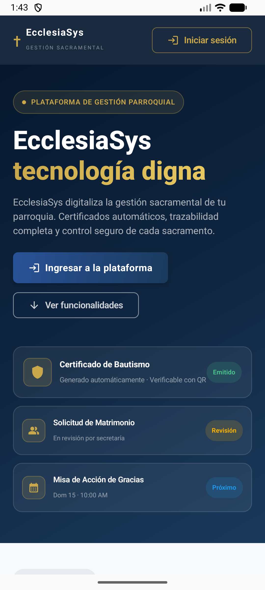
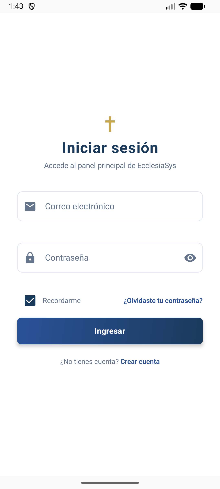
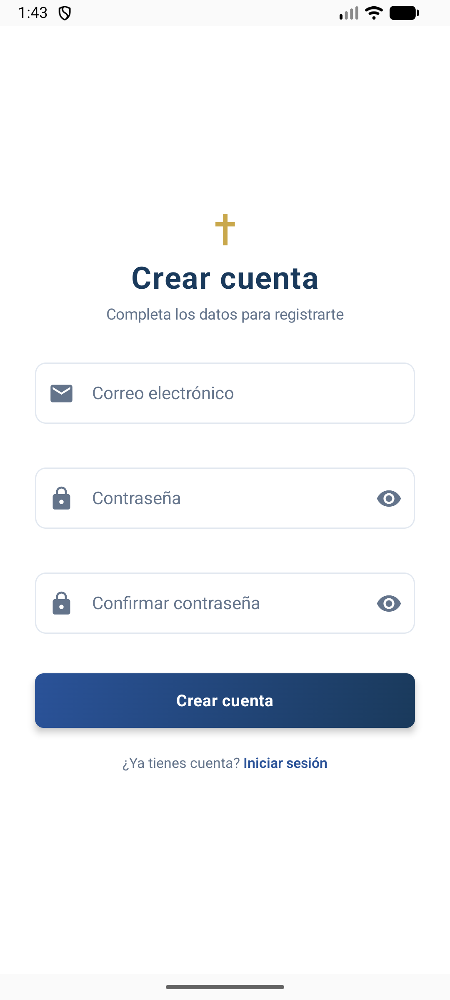
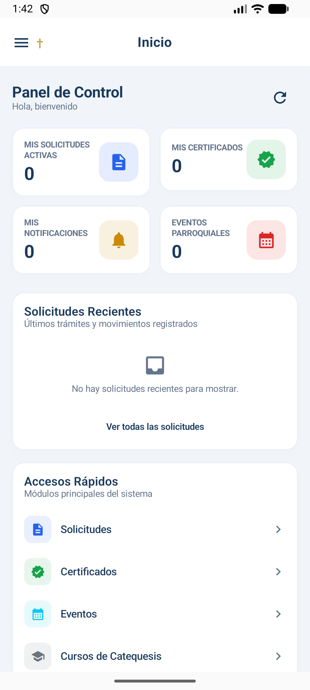
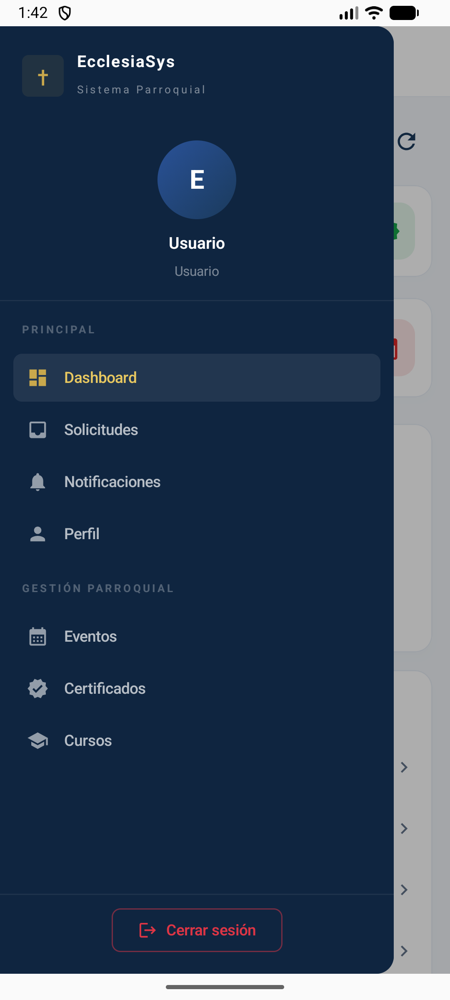
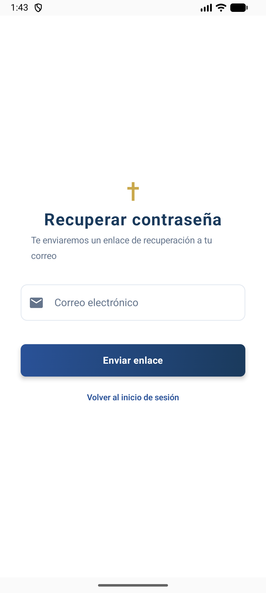

# EcclesiaSys

Aplicación Android para la gestión integral de iglesias: administración de miembros, eventos, pagos, cursos, certificados, sacramentos, solicitudes y más. Construida 100% en **Kotlin** con **Jetpack Compose** y arquitectura **MVVM**.

## Características

- Autenticación completa: registro, inicio de sesión, recuperación y restablecimiento de contraseña, verificación de email
- Gestión de sesiones con tokens de acceso/refresh y renovación automática (`TokenAuthenticator`)
- Dashboard con resumen general
- Módulos de administración:
  - Personas (listado con búsqueda, paginación y detalle)
  - Eventos, Cursos y Certificados
  - Pagos y Solicitudes
  - Sacramentos
  - Usuarios y Roles
  - Auditoría de actividad
  - Notificaciones y Configuración
- UI reactiva con estado (`UiState` por pantalla), manejo de carga, errores y confirmaciones
- Componentes reutilizables: campos de texto validados, medidor de fuerza de contraseña, skeletons de carga, snackbars, diálogos de confirmación, paginación

## Capturas de pantalla

<p align="center">
  
  &nbsp;
  
  &nbsp;
  
</p>
<p align="center">
  
  &nbsp;
  
  &nbsp;
  
</p>

## Tecnologías

| Categoría | Tecnología |
|---|---|
| Lenguaje | Kotlin 2.2 |
| UI | Jetpack Compose + Material 3 |
| Arquitectura | MVVM (ViewModel + UiState + Repository) |
| Navegación | Navigation Compose |
| Red | Retrofit 2 + OkHttp 4 |
| Serialización | kotlinx.serialization |
| Almacenamiento | DataStore Preferences |
| Imágenes | Coil |
| Inyección manual | Factory pattern por ViewModel |

## Requisitos

- Android Studio (con SDK 37)
- JDK 11+
- Dispositivo o emulador con Android 8.1 (API 27) o superior
- Backend REST de Ecclesia corriendo en `http://127.0.0.1:8000` (para desarrollo)

## Ejecución del proyecto

1. Clona el repositorio:
   ```bash
   git clone https://github.com/Samir19-Dev/EcclesiaAndroid.git
   ```
2. Ábrelo en Android Studio y sincroniza Gradle.
3. Inicia el backend local en el puerto 8000.
4. Ejecuta la app desde Android Studio. La tarea `adbReverseBackend` configura automáticamente `adb reverse tcp:8000 tcp:8000` para conectar con el backend local.

> La URL base de la API se define en `app/build.gradle.kts`: `http://127.0.0.1:8000/api/v1/` para debug y `https://api.ecclesia.com/api/v1/` para release.

## Estructura del proyecto

```
app/src/main/java/com/ecclesia/android/
├── data/
│   ├── network/        # Retrofit, interceptores, autenticación y sesión
│   └── repository/     # Fuentes de datos por dominio
├── domain/
│   └── models/         # Modelos de negocio
└── ui/
    ├── components/     # Componentes Compose reutilizables
    ├── navigation/     # NavHost y destinos
    ├── screens/        # Pantallas (Screen + UiState + ViewModel)
    └── theme/          # Tema, colores y tipografía (Cinzel / Inter)
```

## Autor

**Samir** - [Samir19-Dev](https://github.com/Samir19-Dev)
